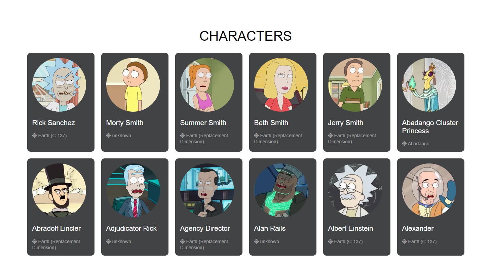
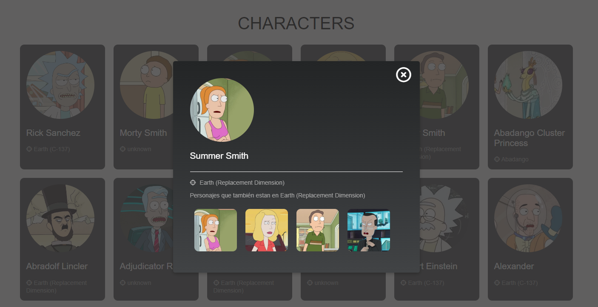

# Tattoox

Technical test for Tattoox.

## Funcional Description

- See Characters
- Modal Display

## Setup

In the project directory, you can run:

### `npm install && npm start`

Runs the app in the development mode.\
Open [http://localhost:3000](http://localhost:3000) to view it in the browser.